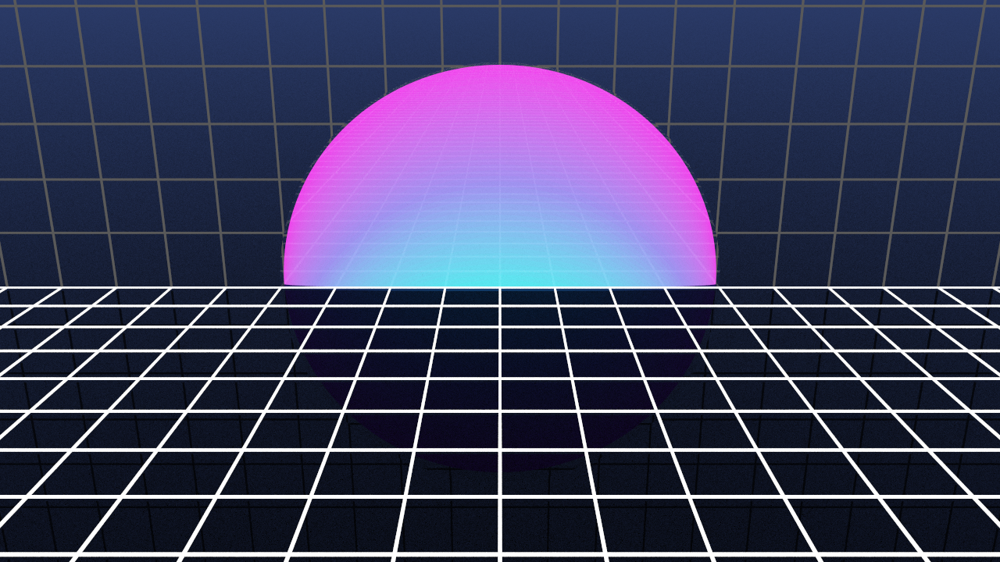

# Computergrafik Grundlagen Sommersemester 2022

Im Laufe des Kurses wurde ein Raytracer entwickelt, der es ermöglicht, 3D-Szenen mit
realistischer Beleuchtung zu erstellen.

# Ergebnisse

## Aufgabe 12

## Aufgabe 9

## Aufgabe 8

## Aufgabe 7

## Aufgabe 6

## Aufgabe 5

## Aufgabe 4

## Aufgabe 3

## Aufgabe 2

## Aufgabe 1

